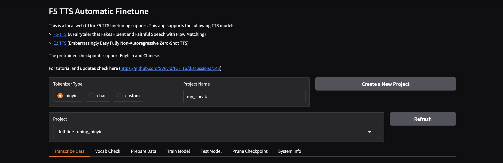
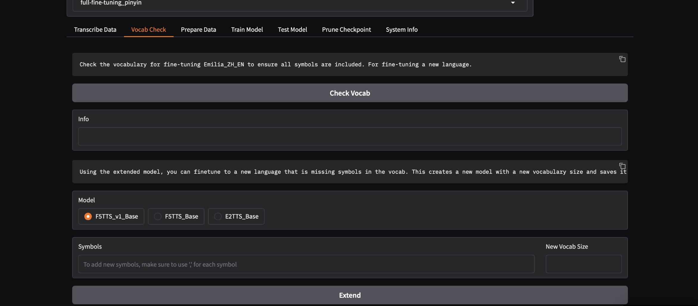
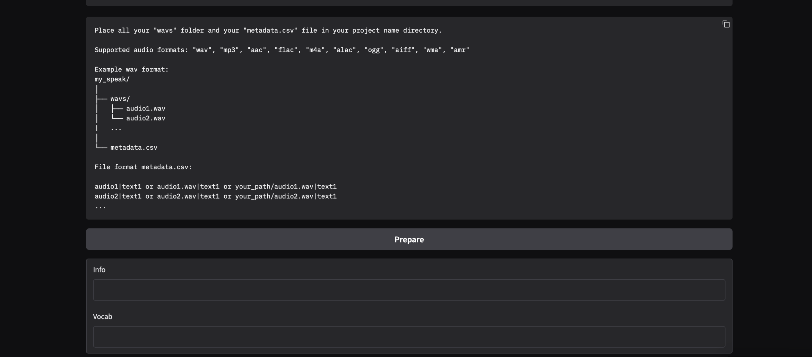
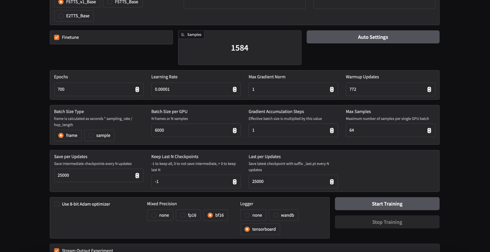

# F5-TTS: A Fairytaler that Fakes Fluent and Faithful Speech with Flow Matching

**F5-TTS**: Diffusion Transformer with ConvNeXt V2, faster trained and inference.
**E2 TTS**: Flat-UNet Transformer, closest reproduction from [paper](https://arxiv.org/abs/2406.18009).

## Installation

### Create a environment - using Conda

```bash
# Create a python 3.10 conda env 
conda create -n f5-tts python=3.10
conda activate f5-tts
```

### Create a environment - using venv

```bash
# Create a python 3.10 venv
python3.10 -m venv f5-tts
source f5-tts/bin/activate
```


### Install PyTorch with matched device

<details>
<summary>NVIDIA GPU</summary>

> ```bash
> # Install pytorch with your CUDA version, e.g.
> pip install torch==2.4.0+cu124 torchaudio==2.4.0+cu124 --extra-index-url https://download.pytorch.org/whl/cu124
> ```

</details>

<details>
<summary>AMD GPU</summary>

> ```bash
> # Install pytorch with your ROCm version (Linux only), e.g.
> pip install torch==2.5.1+rocm6.2 torchaudio==2.5.1+rocm6.2 --extra-index-url https://download.pytorch.org/whl/rocm6.2
> ```

</details>

<details>
<summary>Intel GPU</summary>

> ```bash
> # Install pytorch with your XPU version, e.g.
> # Intel® Deep Learning Essentials or Intel® oneAPI Base Toolkit must be installed
> pip install torch torchaudio --index-url https://download.pytorch.org/whl/test/xpu
> 
> # Intel GPU support is also available through IPEX (Intel® Extension for PyTorch)
> # IPEX does not require the Intel® Deep Learning Essentials or Intel® oneAPI Base Toolkit
> # See: https://pytorch-extension.intel.com/installation?request=platform
> ```

</details>

<details>
<summary>Apple Silicon</summary>

> ```bash
> # Install the stable pytorch, e.g.
> pip install torch torchaudio
> ```

</details>

### Then you can choose one from below:

> ### Local editable
> 
> ```bash
> git clone https://github.com/SWivid/F5-TTS.git
> cd F5-TTS
> # git submodule update --init --recursive  # (optional, if use bigvgan as vocoder)
> pip install -e .
> ```

## Training

### With Gradio App

```bash
# Quick start with Gradio web interface
f5-tts_finetune-gradio
```

Read [training & finetuning guidance](src/f5_tts/train) for more instructions.

### Data Structure Setup

#### Audio Requirements
- **Duration**: Maximum 30 seconds per audio file
- **Format**: 44kHz WAV files
- **Quality**: High-quality recordings recommended

#### 1. Project Setup

1. Choose **Pinyin** as tokenizer type
2. Enter your **Project Name**
3. Navigate to `data -> [your_project_name]`
4. Create `wavs` folder and add your audio files
5. Add `metadata.csv` with proper format

#### Directory Structure
```
F5-TTS/
├── data/
│   └── [your_project_name]/
│       ├── wavs/
│       │   ├── audio_file_1.wav
│       │   ├── audio_file_2.wav
│       │   └── ...
│       └── metadata.csv
```

#### Metadata Format
Create a `metadata.csv` file with the following structure:
```csv
audio_file|text
SPEAKER_8_s_130|سلبية أو وسوسة الشيطان أن ما يبيك تعيش حزين 
SPEAKER_0_s_12|شاء الله عن كيفية تعلم اللغة الإنجليزية عبر الجوال قبل
SPEAKER_1_s_2|بما يقوله هذه قد تكون ميزة وقد تكون عيب
```

**Important**: Do NOT add ".wav" extension to the audio file names in the metadata.


#### 2. Vocabulary Check

1. Click **"Check vocab"** in the Gradio interface
2. Choose model: **"F5TTS_v1_Base"** or **"F5TTS_Base"**
3. Click **"Extend"** to update vocabulary

#### 3. Data Preparation

1. Click **"Prepare"** to process your data
2. Verify correctness by clicking **"Random Sample"**
3. Review generated samples for quality

#### 4. Model Training

**Training Configuration:**
- **Model**: Choose between F5TTS_v1_Base or F5TTS_Base
- **Batch Size Type**: Select "frame"
- **Mixed Precision**: Use bf16 for better performance
- **Epochs**: Set high number (extensive training required)

**Important Training Notes:**
- F5-TTS requires **extensive training** for good results
- Monitor training progress and adjust epochs accordingly
- Use auto settings as starting point, then fine-tune parameters

#### 5. Model Testing
- Test the model with random samples during training
- Evaluate speech quality and naturalness
- Adjust training parameters if needed

#### 6. Checkpoint Management
- Save the best or last checkpoint
- Export as `.pth` or `.safetensors` format
- Prune unnecessary checkpoints to save space

## Inference

### Using Custom Pipeline Script
Use the provided `run_pipeline.py` script for automated inference:

1. **Prepare Input**: Create `sentences.txt` with sentences for synthetic speech generation

2. **Run Inference**: Execute the pipeline script with your trained model

#### Example Command
```bash
python run_pipeline.py \
  --num_samples 5 \
  --speakers SPEAKER_0200 \
  --model F5TTS_v1_Base \
  --ckpt_file F5-TTS/ckpts/full-fine-tuning/model_last.safetensors \
  --vocab_file F5-TTS/data/full-fine-tuning_pinyin/vocab.txt \
  --wav_dir F5-TTS/data/full-fine-tuning_pinyin/wavs \
  --metadata_csv F5-TTS/data/full-fine-tuning_pinyin/metadata.csv \
  --gen_txt F5-TTS/sentences.txt \
  --out_root F5-TTS/tests \
  --output_metadata metadata.csv
```

#### Parameter Description
- `--num_samples`: Number of audio samples to generate
- `--speakers`: Target speaker ID from your training data
- `--model`: Base model architecture used
- `--ckpt_file`: Path to your fine-tuned model checkpoint
- `--vocab_file`: Vocabulary file from data preparation
- `--wav_dir`: Directory containing reference audio files
- `--metadata_csv`: Training metadata file
- `--gen_txt`: Text file containing sentences to synthesize
- `--out_root`: Output directory for generated audio
- `--output_metadata`: Output metadata filename

## Acknowledgements

- [E2-TTS](https://arxiv.org/abs/2406.18009) brilliant work, simple and effective
- [Emilia](https://arxiv.org/abs/2407.05361), [WenetSpeech4TTS](https://arxiv.org/abs/2406.05763), [LibriTTS](https://arxiv.org/abs/1904.02882), [LJSpeech](https://keithito.com/LJ-Speech-Dataset/) valuable datasets
- [lucidrains](https://github.com/lucidrains) initial CFM structure with also [bfs18](https://github.com/bfs18) for discussion
- [SD3](https://arxiv.org/abs/2403.03206) & [Hugging Face diffusers](https://github.com/huggingface/diffusers) DiT and MMDiT code structure
- [torchdiffeq](https://github.com/rtqichen/torchdiffeq) as ODE solver, [Vocos](https://huggingface.co/charactr/vocos-mel-24khz) and [BigVGAN](https://github.com/NVIDIA/BigVGAN) as vocoder
- [FunASR](https://github.com/modelscope/FunASR), [faster-whisper](https://github.com/SYSTRAN/faster-whisper), [UniSpeech](https://github.com/microsoft/UniSpeech), [SpeechMOS](https://github.com/tarepan/SpeechMOS) for evaluation tools
- [ctc-forced-aligner](https://github.com/MahmoudAshraf97/ctc-forced-aligner) for speech edit test
- [mrfakename](https://x.com/realmrfakename) huggingface space demo ~
- [f5-tts-mlx](https://github.com/lucasnewman/f5-tts-mlx/tree/main) Implementation with MLX framework by [Lucas Newman](https://github.com/lucasnewman)
- [F5-TTS-ONNX](https://github.com/DakeQQ/F5-TTS-ONNX) ONNX Runtime version by [DakeQQ](https://github.com/DakeQQ)
- [Yuekai Zhang](https://github.com/yuekaizhang) Triton and TensorRT-LLM support ~

## Citation
If our work and codebase is useful for you, please cite as:
```
@article{chen-etal-2024-f5tts,
      title={F5-TTS: A Fairytaler that Fakes Fluent and Faithful Speech with Flow Matching}, 
      author={Yushen Chen and Zhikang Niu and Ziyang Ma and Keqi Deng and Chunhui Wang and Jian Zhao and Kai Yu and Xie Chen},
      journal={arXiv preprint arXiv:2410.06885},
      year={2024},
}
```
## License

Our code is released under MIT License. The pre-trained models are licensed under the CC-BY-NC license due to the training data Emilia, which is an in-the-wild dataset. Sorry for any inconvenience this may cause.
